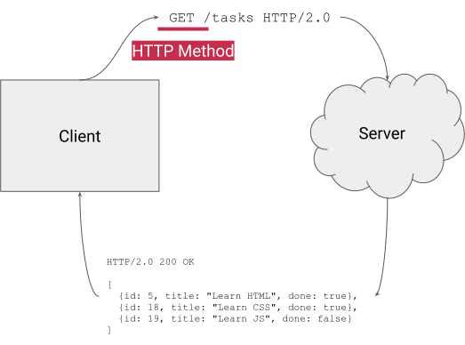
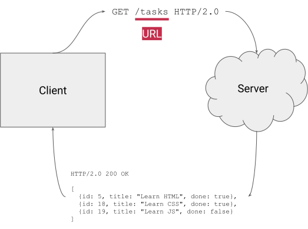
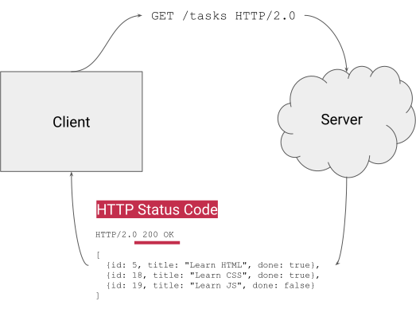

## Learning Objectives

- Understand what a REST service is
- Create a simple REST service with Django

## Agenda

- REST
- Django
- Models
- Django REST framework
- Filters

## Resources

- [docs.djangoproject.com](https://docs.djangoproject.com)
- [django-rest-framework.org](https://www.django-rest-framework.org/)
- [django-filter.readthedocs.io](https://django-filter.readthedocs.io/)

## REST Diagram


## HTTP Method Diagram



## URL Diagram



## HTTP Status Diagram



## HTTP Overview

[_An overview of HTTP_, MDN](https://developer.mozilla.org/en-US/docs/Web/HTTP/Overview)

## HTTP Methods

4 out of the 9 HTTP methods:

- [`GET`](https://developer.mozilla.org/en-US/docs/Web/HTTP/Methods/GET): show something.
- [`POST`](https://developer.mozilla.org/en-US/docs/Web/HTTP/Methods/POST): add something.
- [`DELETE`](https://developer.mozilla.org/en-US/docs/Web/HTTP/Methods/DELETE): remove something.
- [`PATCH`](https://developer.mozilla.org/en-US/docs/Web/HTTP/Methods/PATCH): modify something.

## HTTP Headers

```
HTTP/1.1 200 OK
Date: Sat, 09 Oct 2010 14:28:02 GMT
Server: Apache
Last-Modified: Tue, 01 Dec 2009 20:18:22 GMT
ETag: "51142bc1-7449-479b075b2891b"
Accept-Ranges: bytes
Content-Length: 29769
Content-Type: text/html

<!DOCTYPE html...
```

Additional key-value pairs passed with a request or response.

## HTTP Status Ranges

<blockquote class="twitter-tweet"><p lang="en" dir="ltr">HTTP status ranges in a nutshell:<br><br>1xx: hold on<br>2xx: here you go<br>3xx: go away<br>4xx: you fucked up<br>5xx: I fucked up</p>&mdash; Steve Losh (@stevelosh) <a href="https://twitter.com/stevelosh/status/372740571749572610?ref_src=twsrc%5Etfw">August 28, 2013</a></blockquote> <script async src="https://platform.twitter.com/widgets.js" charset="utf-8"></script>

## HTTP Status

- [`200 OK`](https://developer.mozilla.org/en-US/docs/Web/HTTP/Status/200)
- [`301 Moved Permanently`](https://developer.mozilla.org/en-US/docs/Web/HTTP/Status/301)
- [`303 See Other`](https://developer.mozilla.org/en-US/docs/Web/HTTP/Status/303)
- [`304 Not Modified`](https://developer.mozilla.org/en-US/docs/Web/HTTP/Status/304)
- [`400 Bad Request`](https://developer.mozilla.org/en-US/docs/Web/HTTP/Status/400)
- [`404 Not Found`](https://developer.mozilla.org/en-US/docs/Web/HTTP/Status/404)
- [`451 Unavailable For Legal Reasons`](https://developer.mozilla.org/en-US/docs/Web/HTTP/Status/451) ([read more](https://en.wikipedia.org/wiki/HTTP_451))
- [`500 Internal Server Error`](https://developer.mozilla.org/en-US/docs/Web/HTTP/Status/500)

## URL


Read more: [_What is an URL?_, MDN](https://developer.mozilla.org/en-US/docs/Learn/Common_questions/What_is_a_URL)

## REST Principles

4 of the 6 principles:

- **Client-server separation**.
- **Uniform**: use standard protocols and formats: HTTP, URI, and very often JSON.
- **Stateless**: each request is self-contained and does not depend on prior requests.
- **Cachable**: responses include cache-control information.

## REST Simplified

> Beginners can assume a REST API means an HTTP service that can be called using standard web libraries and tools.
>
> — [_REST_, MDN](https://developer.mozilla.org/en-US/docs/Glossary/REST)

## WSGI/ASGI


- Python web frameworks are often WSGI/ASGI applications
- Most frameworks are invoked per request

## Setting up a Python Environment (Linux, MacOS)

- Virtual environment can be created with the built-in venv module

```
mkdir webservice
cd webservice
python3 -m venv env
env/bin/python --version
env/bin/pip list
env/bin/pip install django
```

## Setting up a Python Environment (Windows)

- On windows, you should use `Scripts` instead of `bin` and might to use backslashes and/or `python` or `py`:

```
mkdir webservice
cd webservice
py -m venv env
env\Scripts\python --version
env\Scripts\pip list
env\Scripts\pip install django
```

## Django

- Model - Template - View
- Free and open source
- Much "magic"
- Old (15 years) but still new features (ASGI)
- Often used, lot of extensions
- One project, many apps

## Django Admin

- The django admin CLI provides skeletons for projects and apps

```
env/bin/django-admin --help
env/bin/django-admin startproject --help
env/bin/django-admin startproject webservice .
env/bin/django-admin startapp shop
```

## Typical Structure of a Django Project


## Django Management

- The django managment script provides commands for database migration, debug server, etc.
- It's possible to define your own commands as well

```
env/bin/python manage.py --help
env/bin/python manage.py migrate
env/bin/python manage.py createsuperuser
env/bin/python manage.py runserver
```

- Frontend: [http://127.0.0.1:8000/](http://127.0.0.1:8000/)
- Backend: [http://127.0.0.1:8000/admin](http://127.0.0.1:8000/admin)

## Exercise 1

- Create a python environment and a django project and app.
- Register your app in the settings.
- Initialize the DB and add a superuser.
- Update the gitignore to ignore the env and the **pycache** directories
- Add a README which explains how to set up the project.

## A Simple REST Service with Django

- In Django, every endpoint has its own view (function or class method)
- Views are mapped to an URL with a route

## Views

- Views are functions which take a request and return a response

```py
from django.http import JsonResponse

def view_article(request):
    return JsonResponse({
        'id': 1,
        'name': 'Screwdriver'
    })
```

## Routing: Application

- Application URLs defined for every view (shop.urls)

```py
from django.urls import path
from shop.views import view_article

urlpatterns = [
    path('articles/1/', view_article),
]
```

## Routing: Project

- All application URLs can be included at an endpoint (webservice.urls)

```py
from django.contrib import admin
from django.urls import include, path

urlpatterns = [
    path('admin/', admin.site.urls),
    path('shop/', include('shop.urls')),
]
```

## Routing: Patterns

- Routing consists of **patterns**
- Variable parts are passed as arguments

```py
urlpatterns = [
    path('articles/<int:id>/', view_article),
]
```

```py
def view_article(request, id):
    return JsonResponse({
        'id': id,
        'name': 'Screwdriver'
    })
```

## Request Method

- The request object contains all information about the current request
- The method is available through the request as string

```py
def view_article(request, id):
    if request.method == 'GET':
        pass
```

- In this case, we need to disable the CsrfViewMiddleware for POST, PATCH and DELETE

## Parsing JSON

- The body of the request may contain JSON

```py
from json import loads

def view_article(request, id):
	data = loads(request.body)
```

## Returning HTTP Status Codes

- There are responses for every status code

```py
from django.http import HttpResponseNotAllowed

def view_article(request, id):
	return HttpResponseNotAllowed(['GET', 'POST'])
```

## Recall: Fetch API (GET)

```js
fetch("https://api.quotable.io/random")
	.then((response) => {
		console.log("HTTP Response status: " + response.status);
		return response.json();
	})
	.then((data) => console.log(data));
```

## Recall: Fetch API (POST)

```js
const data = {
	/*... */
};
fetch("/shop/articles", {
	method: "POST", // *GET, POST, PUT, DELETE, etc.
	body: JSON.stringify(data),
})
	.then((response) => response.json())
	.then((data) => console.log(data));
```

Read more: [_Using Fetch_, MDN](https://developer.mozilla.org/en-US/docs/Web/API/Fetch_API/Using_Fetch)

## Exercise 2

- Create a simple static REST service.
- Add a GET method for all articles and return some fictional IDs
- Add a POST method for all articles and return the given data and a fictional ID
- Add a GET method for one article and return the ID
- Add a PATCH method for one article and return the ID and the given data
- Add a DELETE method for an article and return the ID
- Return a HTTP 405 for other cases
- Test the views with curl

## Django Models

- Django has its own object-relational mapper (ORM)
- Requests are normally NOT bound to a transaction but immediately commited
- Some DB interactions may need an atomic decorator/context manager

```py
from django.db.models import Model
from django.db.models import CharField


class Article(Model):
    name = CharField(max_length=50)
```

- Every model gets automatically an auto-incremented id!

## Fields

- Django provides a lot of different DB fields, more are available using additional libraries
- **Boolean**: BooleanField
- **Text**: CharField, TextField, EmailField, URLField, UUIDField, FilePathField
- **Numbers**: IntegerField, FloatField, DecimalField
- **JSON**: JSONField
- **Files**: FileField, ImageField
- **Date & Time**: DurationField, DateField, DateTimeField, TimeField
- **Relationships**: ForeignKey, ManyToManyField, OneToOneField

## Querying

- Django allows DB interaction using the `objects` property of any model

```py
Article.objects.create(name=name)

Article.objects.all()
Article.objects.all()[:5]

Article.objects.filter(id=id).get()
Article.objects.filter(id=id).first()

Article.objects.order_by('name').all()[:5]
Article.objects.order_by('-name').all()[:5]

article.name = name
article.save()
article.delete()
```

## Migrations

- Djangos migration management is reason alone to chose it! It supports automatic migration script creation and historical models!

```
env/bin/python manage.py makemigrations
env/bin/python manage.py migrate
```

## Admin UI

- Models can be registered and are then available at the admin UI

```py
from django.contrib.admin import ModelAdmin, register
from shop.models import Article

@register(Article)
class ArticelAdmin(ModelAdmin):
    pass
```

## Exercise 3

- Define a database model for the articles
- Create the migration script and migrate the database
- Use the model in the views
- Register the model for the admin UI
- Return a 404 if the article with a given ID does not exist

## Django REST framework

- Django REST framework is a django extension for easily creating REST APIs
- Browsable API: [http://127.0.0.1:8000/](http://127.0.0.1:8000/)

## Installing Packages Using a Textfile

- pip allows installation from a text file

```
pip install -r requirements.txt
```

- it's possible to pin version

```
django==3.2.4
djangorestframework
```

## Set up the Django REST framework

- Install

```
pip install djangorestframework

```

- Enable

```py
INSTALLED_APPS = [
    ...
    'rest_framework',
]
```

## View Sets

- Viewsets are classes which provide CRUD operations for models

```py
from shop.models import Article
from shop.serializers import ArticleSerializer
from rest_framework.viewsets import ModelViewSet


class ArticleViewSet(ModelViewSet):
    queryset = Article.objects.all()
    serializer_class = ArticleSerializer
```

## Actions

- Additional actions can be defined for on instance or all instances

```py
from shop.models import Article
from shop.serializers import ArticleSerializer
from rest_framework.viewsets import ModelViewSet
from rest_framework.decorators import action


class ArticleViewSet(ModelViewSet):
    queryset = Article.objects.all()
    serializer_class = ArticleSerializer

	@action(detail=True, methods=['post'])
	def restock(self, request, pk=None):
		pass

	@action(detail=False)
	def popular(self, request):
		pass
```

## Serializers

- Serializers define the data format of a model for requests and responses

```py
from shop.models import Article
from rest_framework.serializers import HyperlinkedModelSerializer

class ArticleSerializer(HyperlinkedModelSerializer):

    class Meta:
        model = Article
        fields = ['id', 'name']
        read_only_fields = ['id']
```

## Routing: Routers

- Routers register all CRUD operations for viewsets

```py
from shop.views import ArticleViewSet
from rest_framework.routers import DefaultRouter

router = DefaultRouter()
router.register('articles', ArticleViewSet)
urlpatterns = router.urls
```

## Exercise 4

- Install the Django REST framework
- Add a serializer for your model
- Replace your own views with a viewset
- Test the API with the browsable API

## Filtering

- Query parameters are often used for ordering and filtering

```
https://duckduckgo.com/?t=ffab&q=query+parameters&ia=web
```

- Django filters allows filtering with query parameters together with the REST framework

## Setting up Django Filters

- install

```
pip install django-filter

```

- enable and configure

```py
INSTALLED_APPS = [
    ...
    'django_filters',
]

REST_FRAMEWORK = {
    'DEFAULT_FILTER_BACKENDS': [
        'django_filters.rest_framework.DjangoFilterBackend'
    ]
}
```

## Filter Sets

- Filter sets are classes which define filters for models

```py
from django_filters import FilterSet
from shop.models import Article

class ArticleFilter(FilterSet):

    class Meta:
        model = Article
        fields = ['category']
```

## View Sets with Filters

- Filtersets can be added to view sets

```py
from shop.filters import ArticleFilter
from shop.models import Article
from shop.serializers import ArticleSerializer
from rest_framework.viewsets import ModelViewSet


class ArticleViewSet(ModelViewSet):
    queryset = Article.objects.all()
    serializer_class = ArticleSerializer
    filterset_class = ArticleFilter
```

## Exercise 5

- Install django-filter
- Add categories to your model
- Add a filter to your viewset for filtering by category
- Test the filters with the browsable API

## What's next?

- Have a look at [relationships](https://docs.djangoproject.com/en/3.2/topics/db/examples/)
- Extend your models
- Have a lookt at [testing](https://pytest-django.readthedocs.io/)
